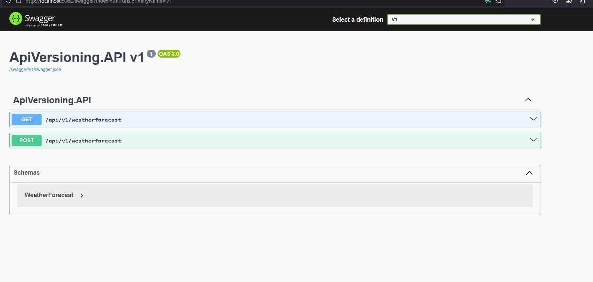
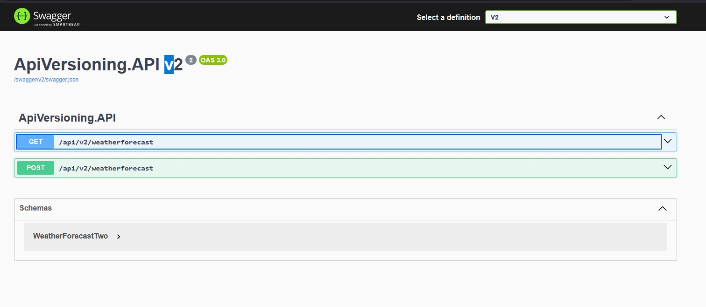

# API Versioning




This is a prototype specifically aimed at documenting ways to version Minimal APIs 
with the usage of Microsoft's extensions:

- `Asp.Versioning.Http`
- `Asp.Versioning.Mvc.ApiExplorer`
- `Asp.Versioning.Mvc` (For Controllers)

## Initial Setup

At the `Program.cs` in order to set up versioning we can start with service 
registration:

```
builder.Services.AddApiVersioning(options =>
{
    options.DefaultApiVersion = new ApiVersion(1);
    options.ReportApiVersions = true;
    options.ApiVersionReader = new UrlSegmentApiVersionReader();
});
```

We will have a default version being at `1`. And by setting `ReportApiVersions = true` 
we are actually configuring the API to always send a response header to always indicate 
what are the supported API versions of the endpoint that was requested, plus the 
deprecated ones. **IMPORTANT:** This specific property is not necessary for Minimal 
APIs because there's another way to pass it, but it's good to know.

Also, the `ApiVersionReader` adheres to the idea that there are different patterns 
to set up API versioning. In our case we will use url segments to denote the API 
version (e.g., `/api/v1/workouts`).

It's also worth noting that you can combine the different API versioning methods 
for whatever the use case might require: `ApiVersionReader.Combine(new UrlSegmentApiVersionReader(), new HeaderApiVersionReader("X-ApiVersion");`.

Right after this we can then add through extension methods further configuration 
for our versioning:

```
.AddApiExplorer(options =>
    {
        options.GroupNameFormat = "'v'V";
        options.SubstituteApiVersionInUrl = true;
    });
```
We can configure how will the format for versioning work through a template, in 
the case of `"'v'V"`we are putting between simple quotes a literal `v` character, 
and then with uppercase`V` the actual version number. (e.g., v1, v2, v3). And 
`SubstituteApiVersionInUrl` is key since this will tell the versioning API to 
substitute all the api versions in the endpoint templates. Otherwise, it won't 
be able to do so. _Note:_ In the case of Controllers you can just add `.AddMvc()` 
before the `AddApiExplorer` call and everything can remain the same.

One way to set up versioning inside a Minimal API is by using an extension method 
such as `WithApiVersionSet()`.

```
app.MapGet("api/v{apiVersion:apiVersion}/weatherforecast", () =>
    {
        var forecast = Enumerable.Range(1, 5).Select(index =>
                new WeatherForecast
                (
                    DateOnly.FromDateTime(DateTime.Now.AddDays(index)),
                    Random.Shared.Next(-20, 55),
                    summaries[Random.Shared.Next(summaries.Length)]
                ))
            .ToArray();
        return forecast;
    })
    .WithApiVersionSet(app
        .NewApiVersionSet()
        .HasApiVersion(new ApiVersion(1))
        .HasDeprecatedApiVersion(new ApiVersion(2))
        .ReportApiVersions()
        .Build())
    .WithName("GetWeatherForecast");
```
As you can see, we are initializing a `ApiVersionSet` instance that will dictate 
how our endpoint will be prefixed, (thanks to the `WithApiVersionSet()` extension 
method to which we feed the object to). Notice how we declare an apiVersion:apiVersion 
template at the endpoint definition. This is key to mark it for it to be managed 
by the versioning API. Another important thing to highlight is the `ReportApiVersions` 
method, if this is not set, we won't get response headers of supported and deprecated 
versions.

However, there's a better way to group up different endpoints with different 
version rules:
```
var apiVersionSet = app
    .NewApiVersionSet()
    .HasApiVersion(new ApiVersion(1))
    .HasDeprecatedApiVersion(new ApiVersion(2))
    .ReportApiVersions()
    .Build();
var groupBuilder = app.MapGroup("api/v{apiVersion:apiVersion}").WithApiVersionSet(apiVersionSet);

groupBuilder.MapGet("weatherforecast", () =>
    {
        var forecast = Enumerable.Range(1, 5).Select(index =>
                new WeatherForecast
                (
                    DateOnly.FromDateTime(DateTime.Now.AddDays(index)),
                    Random.Shared.Next(-20, 55),
                    summaries[Random.Shared.Next(summaries.Length)]
                ))
            .ToArray();
        return forecast;
    })
    .WithName("GetWeatherForecast");
```
We can get an instance of `ApiVersionSet` and feed that into a `RouteGroupBuilder`, 
so that we establish a sort _prototype_ for a set of endpoints we want to configure 
under. It's then that we can use the `RouteGroupBuilder` to replace the previous 
`app` instance to then start declaring the endpoints `MapGet`, `MapPost`, etc. As 
you can see we use this to prefix things and attach versioning.

**_NOTE:_** The `v{apiVersion:apiVersion}` is key for behaviors that are already 
built for us by the Nuget. This is a route template, and under this specific syntax 
it integrates with `Asp.Versioning`. In this instance `{apiVersion:apiVersion}` is a 
**route parameter** where:

- `apiVersion` is a **placeholder** that will be replaced with the actual version 
at runtime
- `:apiVersion` is a route constraint that ensures the value conforms to an expected 
API version format.

According to the configured versioning scheme, then the respective API endpoint will 
be configured. How does this help us? We get automatic responses based on the type 
of request we get: If a request is made to an **unsupported API version**. `Asp.Versioning` 
will return a `400 Bad Request` or `404 Not Found`, depending on the configuration.

Paired up with `.ReportApiVersions()  // Includes available versions in responses`. 
If a client requests an unsupported version, they will receive a response like this:

```json
{
  "error": "Unsupported API version.",
  "availableVersions": ["1.0", "2.0"]
}
```

## A more concise and maintainable approach

Having delved a bit into the syntax and ways to configure versioning, we can now 
establish a more robust pattern that should be implemented on actual applications. 
And that is instead of coupling endpoint logic/classes to the whole versioning 
side, we can just feed a `IEndpointRouteBuilder` to them as we would just pass an `app` 
instance. And have all the versioning behavior configured outside of it:

At the `Program.cs` we can do something like this:
```
var apiVersionSet = app
    .NewApiVersionSet()
    .HasApiVersion(new ApiVersion(1))
    .HasApiVersion(new ApiVersion(2))
    .ReportApiVersions()
    .Build();
var groupBuilder = app.MapGroup("api/v{apiVersion:apiVersion}").WithApiVersionSet(apiVersionSet);

groupBuilder.MapWeatherForecastEndpoints();
```

And that `MapWeatherForecastEndpoints()` extension method be in a different file 
that will simply register the domain specific endpoints:

```
namespace ApiVersioning.API;

public static class WeatherForecastEndpoints
{
    private static readonly string[] Summaries =
    [
        "Freezing", "Bracing", "Chilly", "Cool", "Mild", "Warm", "Balmy", "Hot", "Sweltering", "Scorching"
    ];

    public static void MapWeatherForecastEndpoints(this IEndpointRouteBuilder app)
    {
        app.MapGet("weatherforecast", () =>
            {
                var forecast = Enumerable.Range(1, 5).Select(index =>
                        new WeatherForecast
                        (
                            DateOnly.FromDateTime(DateTime.Now.AddDays(index)),
                            Random.Shared.Next(-20, 55),
                            Summaries[Random.Shared.Next(Summaries.Length)]
                        ))
                    .ToArray();
                return forecast;
            })
            .WithName("GetWeatherForecast");
    }
}
```
If you don't want to clutter the `Program.cs` file even further, you can totally 
abstract this under another file or pattern. But the idea is there, to decouple 
versioning concerns from the endpoint declaration, and move them elsewhere, so that 
it's not brittle. It leverages interfaces so that we can easily switch between 
a bare route builder and a preconfigured instance so that the endpoint declaration 
code doesn't have to suffer major changes.

### The final piece of the puzzle

How do you mark a specific endpoint to map to a specific version? That's pretty 
simple, you would "duplicate" endpoint code, in the sense that you will declare 
another endpoint, yet, you should make use of the `MapToApiVersion()` extension 
method.

```
namespace ApiVersioning.API;

public static class WeatherForecastEndpoints
{
    private static readonly string[] Summaries =
    [
        "Freezing", "Bracing", "Chilly", "Cool", "Mild", "Warm", "Balmy", "Hot", "Sweltering", "Scorching"
    ];

    public static void MapWeatherForecastEndpoints(this IEndpointRouteBuilder app)
    {
        app.MapGet("weatherforecast", () =>
            {
                var forecast = Enumerable.Range(1, 5).Select(index =>
                        new WeatherForecast
                        (
                            DateOnly.FromDateTime(DateTime.Now.AddDays(index)),
                            Random.Shared.Next(-20, 55),
                            Summaries[Random.Shared.Next(Summaries.Length)]
                        ))
                    .ToArray();
                return forecast;
            })
            .MapToApiVersion(1);

        app.MapGet("weatherforecast", () =>
            {
                var forecast = Enumerable.Range(1, 1).Select(index =>
                        new WeatherForecast
                        (
                            DateOnly.FromDateTime(DateTime.Now.AddDays(index)),
                            Random.Shared.Next(-20, 55),
                            Summaries[Random.Shared.Next(Summaries.Length)]
                        ))
                    .ToArray();
                return forecast;
            })
            .MapToApiVersion(2);
    }
}
```

As you can see, we are technically declaring an endpoint _twice_ however, when running 
the application we won't get routing errors nor when trying to request either of the 
versions. _Small Note_ If we have some metadata attached to our endpoints such as 
`.WithName("GetWeatherForecast")`, This **will** cause the app start-up to crash, 
and that's because we have to differentiate the name, so either add a `v1`, `v2` 
suffix/prefix or just get rid of the metadata.

When trying to get something without a url segment prefix i.e., `api/weatherforecast`, 
we will get a 404. Since there's no endpoint without a version. But switching from 
either `v1` or `v2` should yield results just fine.

**_NOTE:_** If we have an endpoint without an explicit version mapping set to it, 
the library will make sure to find a match to the route, and will default either 
of the supported versions (laid out in the `ApiVersionSet`) to that partial route 
match. The moment we try to hit an unsupported version it will default to a `404`. 
Which tells us that, even if we don't really have use cases for versioning on 
some endpoints, based on the default version we have set up, plus the number of 
supported versions, we can just forget about all of it, and declare endpoints as 
if they were in a _simpler project_ and, it will still work seamlessly. The only 
thing to _be aware of_ is that we will have to account for the version depending on 
the versioning strategy, in the case of URLs we will definitely have to prefix 
the actual resource with the respective `/api/v1` or whatever.

## Swagger integration

First of all, out the box, we already have OpenApi integrations. Which is not 
a UI like swagger, but enables us to hit an endpoint and get a full `json` spec 
with all endpoints that we have registered under the application: [Reference](https://learn.microsoft.com/en-us/aspnet/core/fundamentals/openapi/aspnetcore-openapi?view=aspnetcore-9.0&tabs=visual-studio%2Cvisual-studio-code)

This prototype has left the OpenApi configured, all that's neccesary is:

```
builder.Services.AddOpenApi();

app.MapOpenApi();
```

With these two steps configured one can hit: `https://localhost:<port>/openapi/v1.json` 
and get a JSON response with the registered endpoints.

### Integrating Swagger

**Swagger** provides us with endpoint discovery and schema mapping, but also with 
a really useful `UI`. And so we will install it in order to have it at hand.

Now, when integrating with `Swagger`, we have to extend a bit further our original 
application.

First of all to enable the swagger website at `{baseUrl}/swagger` 
(e.g., `http://localhost:5062/swagger`). We have to install `SwashBuckle.AspNetCore`.

And from there on, you have to configure both services and Http Request Pipeline:

```
builder.Services.AddSwaggerGen();

app.UseSwagger(); // Generates OpenAPI JSON
app.UseSwaggerUI(); // Enables Swagger UI
```

When working with Minimal APIs specifically `AddOpenApi()` helps with discoverability 
from each of them, however the `builder.Services.AddEndpointsApiExplorer()` method 
should be leveraged for Controllers, (it will also discover Minimal APIs though).

- `AddSwaggerGen()` Configures the Swagger generator to create OpenAPI documents 
for the API we have at hand. In here we can configure API information, descriptions 
and more.
- `UseSwagger()` Serves the generated OpenAPI JSON document at a specified endpoint 
`swagger/v1/swagger.json`. This is the middleware that enables the OpenAPI document 
available to clients.
- `UseSwaggerUI()` Enables the Swagger UI, which is a web-based interface to explore 
and interact with the API documentation. This middleware serves the UI at the default 
`/swagger` endpoint.

### Extending swagger to further API versions

Now, once we have Swagger being served and scanning our endpoints we will immediately 
notice something. And that is that API versioning will not be picked up immediately. 
We will only be supporting the default version, which in our case is `v1`. How 
can we make swagger pick up on the other versions?

We will make some configuration adjustments.

First of all we will make use of the `ConfigureOptions()` pattern, which is something 
already built-into .NET and its aim is to centralize configuration of services 
in a structured and testable way; instead of changing the `config` from a service 
in-line, e.g., (`builder.Services.AddSwaggerGen(options => { // Change the options here });`).

And so, knowing that the `options` from the previous example statement is of type `SwaggerGenOptions`, 
if we want to apply a sort of _decorator_ to it to pre-configure it before getting 
its instance, we can leverage a `IConfigureOptions<SwaggerGenOptions>` class.

```csharp
builder.Services.ConfigureOptions<ConfigureSwaggerGenOptions>();

// And the class would look like this
public class ConfigureSwaggerGenOptions : IConfigureNamedOptions<SwaggerGenOptions>
{
    private readonly IApiVersionDescriptionProvider _provider;

    public ConfigureSwaggerGenOptions(IApiVersionDescriptionProvider provider)
    {
        _provider = provider;
    }
    
    public void Configure(SwaggerGenOptions options)
    {
        foreach (ApiVersionDescription description in _provider.ApiVersionDescriptions)
        {
            var openApiInfo = new OpenApiInfo
            {
                Title = $"ApiVersioning.API v{description.ApiVersion}",
                Version = description.ApiVersion.ToString(),
            };
            
            options.SwaggerDoc(description.GroupName, openApiInfo);
        }
    }

    public void Configure(string? name, SwaggerGenOptions options)
    {
        Configure(options);
    }
}
```
- First, we will leverage the DI container to register our option configurator. 
This sets the affected configuration type to be pre-configured with the `IConfigureNamedOptions` 
logic. You can even aggregate tons of different configurators, and they will all 
be applied in sequence. What this means is that if we want to resolve the configuration 
instance, it will be pre-configured with specific settings.
- And if we take a look at the `IConfigureNamedOptions` we will see how it has 
applied as a type parameter `SwaggerGenOptions`. We also make use of DI to resolve 
a `IApiVersionDescriptionProvider` which is from `Asp.Versioning.ApiExplorer`. 
This service can expose to us all registered application versions.
- The interface requires for `Configure` to be implemented under two overloads (a 
named version and a non-named version). We will leverage our injected versioning 
service to retrieve all the registered versions that we have, and we will start 
registering new **Swagger Documents**. By creating a new `OpenApiInfo` object  
we will register new declarations of files to be generated on the Swagger UI that are designed 
to aggregate all possible API versions. If you notice, from the entries under `ApiVersionDescriptions` 
we are making use of a `GroupName` so that we can register different API documents
(swagger doc), e.g., `/swagger/v1/swagger.json`, `swagger/v2/swagger.json`. And of 
course, only the relevant endpoints for the relevant version will be shown on the 
respective manifest.

After we have configured the manifest generation per-version, we will enable 
the Swagger UI to show a dropdown menu and allow us to switch between the different 
endpoint definitions:

```csharp
app.UseSwaggerUI(options =>
{
    IReadOnlyList<ApiVersionDescription> descriptions = app.DescribeApiVersions();

    foreach (ApiVersionDescription description in descriptions)
    {
        string url = $"/swagger/{description.GroupName}/swagger.json";
        string name = description.GroupName.ToUpperInvariant();
        
        options.SwaggerEndpoint(url, name);
    }
}); // Enables Swagger UI
```
This code leverages the api versions descriptions that should be resolvable thanks 
to all our configurations, and after iterating them again, we simply configure 
the entries for the dropdown in the upper right corner of Swagger, and we tie 
that into the generated swagger doc manifests (that are also per version). By 
calling `options.SwaggerEndpoint(url, name)` in the loop we are registering the 
two versions to be shown and to be accessed dynamically.

## Extra Notes

[Reference](https://code-maze.com/aspnetcore-add-global-route-prefix/). There's 
an argument to be made to hide from the consumers the idea of versioning or 
other prefixes. Such as a middleware can add the `/api/` or even versioning 
prefixes for the request. An interesting take for sure.